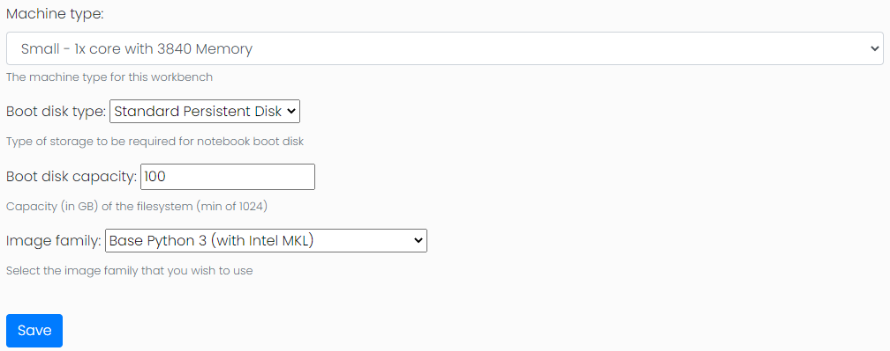
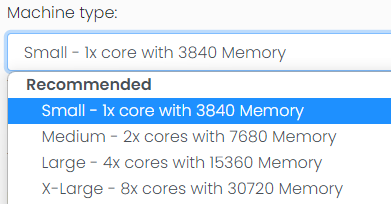

## Workbench Management

The Workbench feature provides a way to create and control VertexAI
Workbenches, which provide a single interactive development
environment using a Jupyter Notebook perfect for pre/post processing
of data. Workbenches can be located within the same VPC as other GCP
resources managed by the FrontEnd.

### Workbench Configuration

The first stage of configuration, after selecting the desired cloud
credential, is to select the basic profile of the workbench 
including:

- Workbench Name
- Subnet
- Cloud Zone
- Trusted User

The subnet will define which regions the workbench can be located in.
Workbenches are not available in all regions, see
[Workbench Documentation](https://cloud.google.com/vertex-ai/docs/general/locations#vertex-ai-workbench-locations)
for more detail on currently available regions. Once a region is
selected the cloud zone field will be populated with the available
zones.

### Trusted Users

The trusted user field will govern which user has access to the
workbench. This is a 1:1 relationship as each workbench has a single
instance owner that is set by the trusted user value. The workbench
is then configured to run the jupyter notebook as the users OSLogin
account. Access to the notebook is controlled by a proxy that
requires the user to be logged into their google account to gain
access.

Workbench instances have a limited number of configurations:
- Machine type
- Boot disk type
- Boot disk capacity
- Image type

### Machine type & Workbench Presets

An administrator can configure any type of machine type that is
available. Users with the "Normal User" class will only be able to
create workbenches using the preset machine type configurations while
users with the "Viewer" class will not be able to create workbenches
for themselves. The HPC toolkit frontend comes with some
pre-configured workbench presets:
- Small - 1x core with 3840 Memory (n1-standard-1)
- Medium - 2x cores with 7680 Memory (n1-standard-2)
- Large - 4x cores with 15360 Memory (n1-standard-4)
- X-Large - 8x cores with 30720 Memory (n1-standard-8)

Each of these have been created under the category "Recommended".
Presets can be edited, deleted or new presets added via the admin
panel where you can set the machine type and the category under which
the user will see the preset.

### Workbench Storage

The final setup of the workbench is to select any filesystems that
are required to be mounted on the workbench. On this page the
configuration fields will be disabled and no changes will be possible
to the workbench configuration.

Within this configuration you can select from existing storage
exports, the order they are mounted, and the mouth path in the
filesystem. Storage will be mounted in the order according to the
mount order which will be important if you are mounting storage
within a sub-directory of another storage mount. Another important
configuration to be aware of is that filesystems will only be
mounted if the filestore or cluster is active and has an accurate
IP address or hostname in the frontends database.

### Workbench problems

#### Storage not mounted
If the expected filesystem storage has not been mounted or is not
available the most likely cause is that the database does not have a
hostname or IP address for the filestore or cluster targeted. An
admin can resolve this by accessing the instance by SSH-ing into the
GCP instance the runs the workbench and running
`mount $IPADDRESS:/$TARGETDIR $MOUNTPOINT`

#### Workbench stuck in "Creating" status
If a workbench is stuck in "Creating" status this can be resolved by
manually changing the status back to newly created in the admin
portal and then starting the creation process again. Logs for this
process can be seen at
`$HPCtoolkitHome/frontend/workbenches/workbench_##/terraform/google/`
where HPCtoolkitHome is normally /opt/gcluster and ## will be the id
number of the workbench in question.
