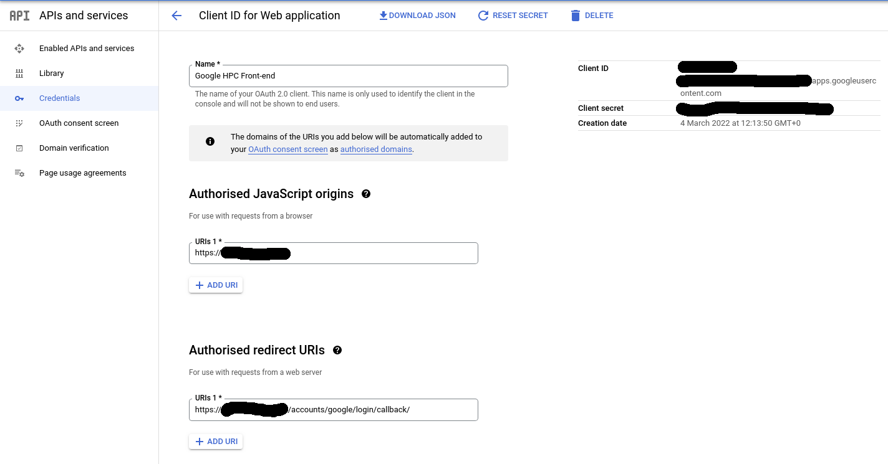

## HPC Toolkit FrontEnd - Administrator’s Guide

### System Deployment

### Post-deployment Configurations

#### SSH access to the service machine

SSH access to the service machine is possible for administration purpose. Administrators can choose from one of the following options:

- An administrator can add his/her public SSH key to the VM instance after the deployment via GCP console or command line.
- An administrator can SSH directly from the GCP console.
- A user with project-wide SSH set in the hosting GCP project should already have SSH access to the service machine.

#### Set up Google login

While it is possible to use a Django user account to access the FrontEnd website, and indeed doing so is required for some administration tasks, ordinary users must authenticate using their Google identities so that, via Google OSLogin, they can maintain consistent Linux identities across VM instances that form the clusters. This is made possible by the *django-allauth* social login extension. 

For a production deployment, a domain name must be obtained and attached to the website. Next, register the site with the hosting GCP project on the GCP console in the *Credentials* section under *APIs and services* category.

From the GCP console, note the client ID and client secret. Then return to admin site of the deployment, locate the *social applications* database table. A 'Google API' record should have been created during the deployment. Replace the two placeholders with the client ID and client secret. The site is ready to accept Google login.

]

Next, go to the *Authorised user* table. This is where further access control to the site is applied. Create new entries to grant access to users. A new entry can be:

- a valid domain name to grant access to multiple users from authorised organisations (e.g. @example.com) 
- an email address to grant access to an individual user. 

Logins that do not match these patterns will be rejected.

### Credential Management

To use the web system to create cloud resources, the first task is for an admin user to register a cloud credential with the system. The supplied credential will be validated and stored in the database for future use.

The preferred way to access GCP resources from this system is through a [Service Account](https://cloud.google.com/iam/docs/service-accounts). To create a service account, a GCP account with sufficient permissions is required. Typically, the Owner or Editor of a GCP project have enough permissions. For other users with custom roles, if certain permissions are missing, GCP will typically return clear error messages. 

For this project, the following roles should be sufficient for the admin users to manage the required service account: *Service Account User*, *Service Account Admin*, and *Service Account Key Admin*.

To register the GCP credential with the system:

- Log in to the GCP console and select the GCP project that hosts this work.
- From the main menu, select *IAM & Admin*, then *Service Accounts*.
- Click the *CREATE SERVICE ACCOUNT* button.
- Name the service account, optionally provide a description, and then click the *CREATE* button.
- Grant the service account the following roles: *Editor*, *Security Admin*.
- Human users may be given permissions to access this service account but that is not required in this work. Clock *Done* button.
- Locate the new service account from the list, click *Manage Keys* from the *Actions* menu.
- Click *ADD KEY*, then *Create new key*. Select JSON as key type, and click the *CREATE* button.
- Copy the generated JSON content which should then be pasted into the credential creation form on the website.
 
### Network Management

All cloud systems begin with defining the network within which the systems will be deployed. Before a cluster or stand-alone filesystem can be created, the administrator must create the virtual cloud network (VPC). This is accomplished under the *Networks* main menu item.

#### Create a new VPC
To create a new network, the admin must first select which cloud credential should be used for this network, then give the VPC a name, and then select the cloud region for the network.

Upon clicking the *Save* button, the network is not immediately created. The admin has to click *Edit Subnet* to create at least one subnet. Once the network and subnets are appropriately defined, click the ‘Apply Cloud Changes’ button to trigger Terraform to provision the  cloud resources.

#### Import an existing VPC

If the organisation already has pre-defined VPCs on cloud within the hosting GCP project, they can be imported. Simply selecting an existing VPC and associated subnets from the web interface to register them with the system. Imported VPCs can be used in exactly the same way as newly created ones.

### Filesystem Management

#### Create new filesystems

#### Import existing filesystems

Import NFS: an external NFS can be registered to this system and subsequently mounted by clusters. For this to work, provide its IP address and export name. The IP address can be:

- A public IP address
- An internal IP address. 

An internal address can be used if the cluster shares the same VPC with the imported filesystem. Alternatively, system administrators can set up hybrid connectivity (such as extablishing network peering) beforing mounting the external filesystem located elsewhere on GCP. 

### Cluster Management

### Application Management

### Job Management

### Benchmarks